# � Formula Legacy

> The ultimate historic database of Formula 1 — A full-stack, data-driven F1 history & analytics platform.

Formula Legacy is an immersive, data-rich application designed to visualize the complete history of Formula 1. It features **driver archives**, **constructor profiles**, **race calendars**, **advanced analytics**, and stunning 8-bit driver portraits, all wrapped in a broadcast-quality racing aesthetic.


---

## 🎨 Design Philosophy

This project embraces a cohesive **motorsport identity** inspired by F1 broadcast graphics:

- **F1 Red (`#E10600`)** & **Racing Black (`#0B0B0B`)** — Primary color palette
- **Typography:** Racing-inspired fonts with monospace data displays
- **Racing Elements:** Checkered flags, racing stripes, speed lines, and tyre animations
- **8-Bit Portraits:** Unique pixel-art driver portraits generated with AI

---

## 🏗️ Architecture

```mermaid
graph TB
    subgraph Frontend["🖥️ Frontend (React + Vite)"]
        UI[React Components]
        Pages[Pages]
        API_Service[API Service Layer]
        UI --> Pages
        Pages --> API_Service
    end

    subgraph Backend["⚙️ Backend (Spring Boot)"]
        Controllers[REST Controllers]
        Repositories[JPA Repositories]
        Entities[Domain Entities]
        Controllers --> Repositories
        Repositories --> Entities
    end

    subgraph Database["🗄️ PostgreSQL"]
        Tables[(F1 Data Tables)]
    end

    subgraph ETL["🔄 ETL Pipeline (Python)"]
        CSV[Ergast CSV Data]
        Loader[load_data.py]
        CSV --> Loader
    end

    API_Service -->|HTTP/REST| Controllers
    Repositories -->|JPA/Hibernate| Tables
    Loader -->|SQLAlchemy| Tables

    style Frontend fill:#1a1a2e,stroke:#E10600,color:#fff
    style Backend fill:#16213e,stroke:#6DB33F,color:#fff
    style Database fill:#0f3460,stroke:#336791,color:#fff
    style ETL fill:#1a1a2e,stroke:#FFD700,color:#fff
```



### Component Details

| Layer | Technology | Purpose |
|-------|------------|---------|
| **Frontend** | React 18 + Vite | Single-page application with racing UI |
| **Styling** | Tailwind CSS | Utility-first CSS with F1 theme |
| **Charts** | Recharts | Analytics visualizations |
| **Backend** | Spring Boot 3.2 | RESTful API server |
| **ORM** | Hibernate/JPA | Object-relational mapping |
| **Database** | PostgreSQL 16 | Relational data storage |
| **ETL** | Python + Pandas | Data loading from Ergast CSV |

---

## 📁 Project Structure

```
formula-legacy/
├── backend/                 # Spring Boot backend
│   ├── src/main/java/com/f1pedia/
│   │   ├── controller/      # REST API endpoints
│   │   ├── domain/          # JPA entities
│   │   └── repository/      # Data access layer
│   └── pom.xml
├── frontend/                # React frontend
│   ├── src/
│   │   ├── components/      # Reusable UI components
│   │   ├── pages/           # Route pages
│   │   ├── services/        # API layer
│   │   └── utils/           # Helper functions
│   └── package.json
├── etl/                     # Data pipeline
│   ├── schema.sql           # Database schema
│   ├── load_data.py         # ETL script
│   └── requirements.txt
├── assets/                  # 8-bit driver portraits
│   ├── *_8bit.png           # Generated portraits
│   └── drivers.md           # Portrait tracking
└── data/                    # Ergast F1 CSV data
```

---

## ✨ Features

### �️ Driver Archive
- Complete list of 860+ F1 drivers
- Legends vs Current Era tabs
- 8-bit AI-generated portraits
- Career statistics

### 🏆 Constructor Profiles
- All 210+ F1 constructors
- Team driver history with stats
- Interactive tyre-spin animation
- Points, wins, podiums breakdown

### 📅 Race Calendar
- Season-by-season race schedules
- 75 years of F1 history (1950-2024)
- Links to full race reports

### 📊 Advanced Analytics
- DNF cause analysis (pie chart)
- Pit stop efficiency rankings
- Season-by-season comparisons

---

## 🚀 Getting Started

### Prerequisites

- **Java 21** (for Spring Boot)
- **Node.js 18+** (for React)
- **PostgreSQL 16** (database)
- **Python 3.10+** (for ETL)

### 1. Database Setup

```bash
# Create database
createdb f1_db

# Run schema
psql -d f1_db -f etl/schema.sql
```

### 2. Load Data (ETL)

```bash
cd etl
pip install -r requirements.txt
python load_data.py
```

### 3. Start Backend

```bash
cd backend
./mvnw spring-boot:run
# API runs on http://localhost:8080
```

### 4. Start Frontend

```bash
cd frontend
npm install
npm run dev
# App runs on http://localhost:5173
```

---

## 🎯 Roadmap

- [x] **Milestone 1:** Database Schema & ETL Pipeline
- [x] **Milestone 2:** Spring Boot Backend (REST API)
- [x] **Milestone 3:** React Frontend (Core Pages)
- [x] **Milestone 4:** Media Layer (8-bit Portraits) — *In Progress*
- [x] **Milestone 5:** Advanced Analytics Dashboard
- [ ] **Milestone 6:** ML Predictions (Race outcomes, championships)
- [ ] **Milestone 7:** Real-time Data Integration

---

## � Screenshots

*Coming soon*

---

## 📄 License

This project is for educational and portfolio purposes. F1 data sourced from [Ergast Developer API](http://ergast.com/mrd/).

---

<p align="center">
  <strong>Formula Legacy</strong> — Racing Through History 🏁
</p>
